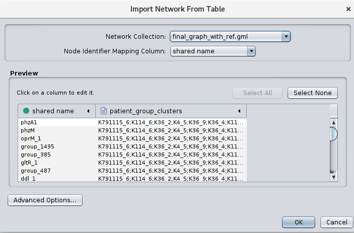
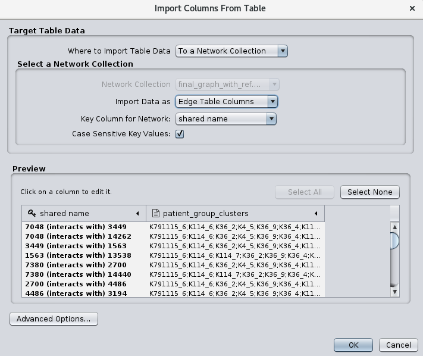
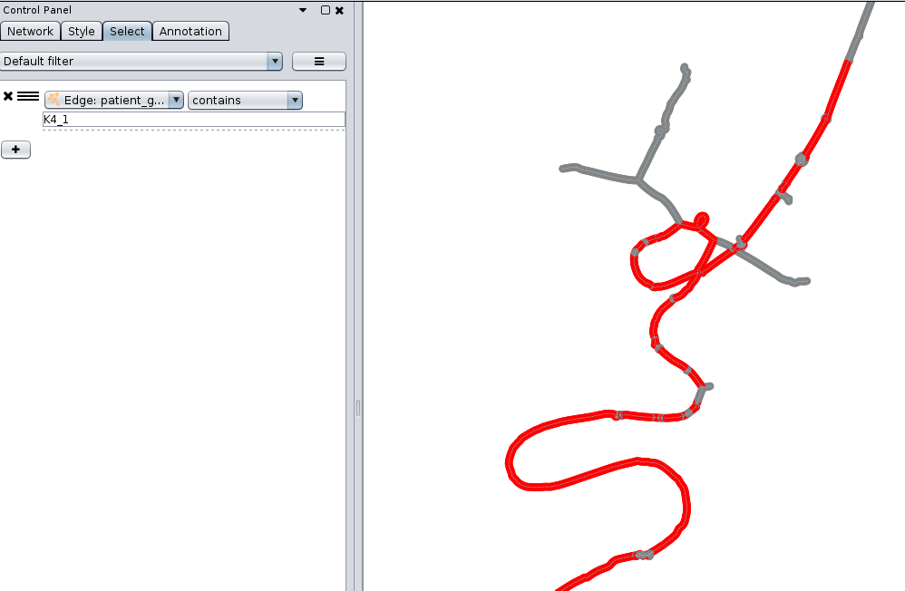

# Meta-data annotation e.g. sequence types

You can annotate the nodes and edges of the Panaroo graph by using any sort of external information e.g. sequence types or antibiotic resistance data.
 You need to compile a tab separated table with the isolate names as the first column and any separate type of annotation as an additional column e.g. 
```Isolate\tMIC_drug_a\tMIC_drug_b\n```
```isol_a\t4\t16\n```
	
You invoke the script by 
```generate_graph_annotation.py isol_annot.txt final_graph.gml edge_annot_out.txt node_annot_out.txt```

Next you can load the graph in Cytoscape and import the node and edge annotation. You can see that individual annotations are separated by  semicolons  
Make sure to select Edge table Columns for the edge annotation  Once imported you will have new node and edeg attribute for every column in your input table. You can then use these to highlight/select nodes and edges in the graph. For example in this example we did a clustering with Fastbaps for every sequence type. K4_1 is the the first fastbaps cluster in sequence type K4. This is how it looks for the nodes (everything highlighted is yellow)  and this is how it looks for the edges (all edges selected are red).  You may have to play with the Style of nodes and edges to make it more obvious.

This works well with the script to produce a reference-based layout.